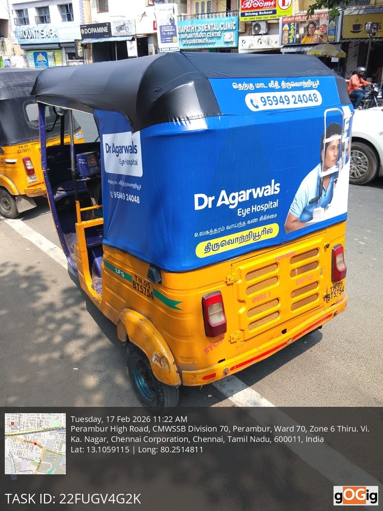
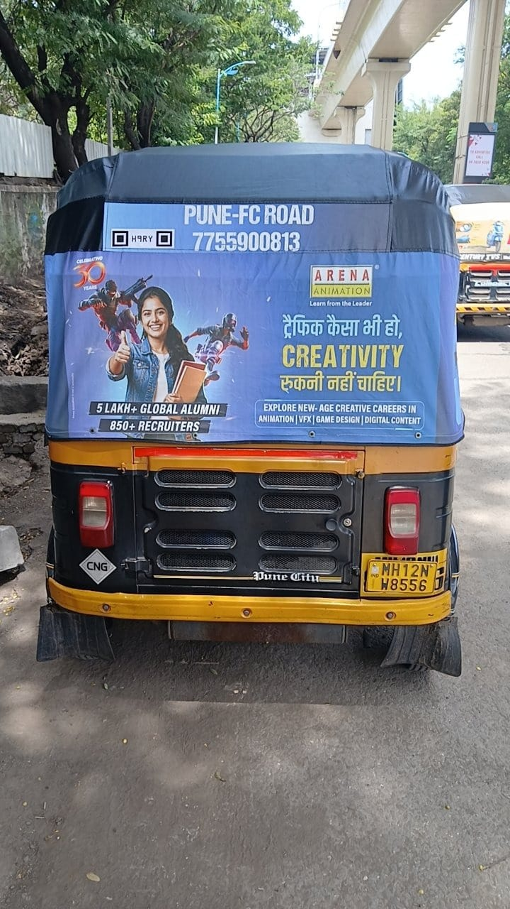
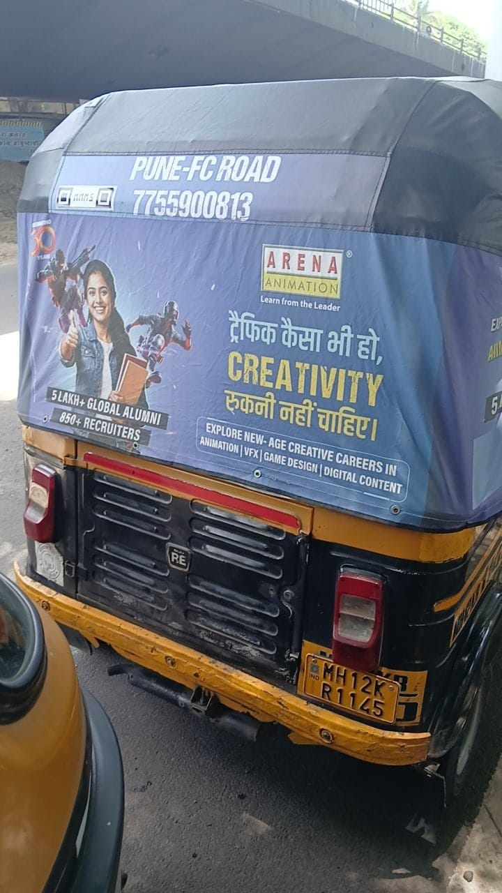

# goGig Intelligent Media Processing Pipeline

An async backend that accepts uploaded vehicle images, queues them for
background analysis, and reports back structured, confidence-scored
findings on common field-photo problems - things like blur, poor lighting,
duplicate uploads, screenshots, tampering signs, and invalid plate format.

Built for the Backend + AI Engineering take-home assignment.

---

## Live Deployment

- **Deployed Link:** https://gogig-media-pipeline.onrender.com/static/upload.html
- **Repository:** https://github.com/pavan-kumar171/gogig-media-pipeline

This is hosted on Render's free tier, which spins the service down after
about 15 minutes of no activity. So the **first request after some idle
time can take 30-60 seconds** to respond while it wakes back up - that's
just how the free tier behaves, not a bug in the app. Everything after
that first request is fast again.

One honest note: on this free-tier deployment, the API and the background
worker run inside a single container (see `entrypoint.sh`), instead of as
two separate containers the way `docker-compose.yml` sets them up locally.
That's purely because a second always-on worker service costs money on
Render's free tier - not a design choice I'd make in production. More on
this under Trade-offs below.

---

## Architecture

### Service flow

Here's how a request moves through the system:

```
Client
  |
  |  POST /api/v1/uploads  (multipart file)
  v
FastAPI (api process)
  1. validate extension/size
  2. save file to disk, get job_id
  3. INSERT image_jobs row (status = pending)
  4. enqueue Celery task  ------------------+
  5. return 202 + job_id immediately        |
                                             v
Client polls:                          Redis (broker)
  GET /jobs/{id}/status                     |
  GET /jobs/{id}/results                    v
                                  Celery worker (separate process)
                                    1. status -> processing
                                    2. decode image once (OpenCV + PIL)
                                    3. run 7 independent checks
                                    4. persist AnalysisCheck rows
                                    5. status -> completed | failed
```

The API process and the worker process never share memory or a database
session - they're separate OS processes (and in Docker, separate
containers) that only talk to each other through Postgres (for state) and
Redis (for the job queue). I did this on purpose: it's the same basic
shape you'd use at real scale, just with one instance of each role instead
of many.

### Processing flow (inside the worker)

Every job moves through: `pending -> processing -> completed | failed`.

The image itself is only decoded **once** per job
(`app/analysis/registry.py:build_context`), into a shared `AnalysisContext`
object that all 7 checks read from - rather than each check opening the
file separately. Here's what those 7 checks do:

| Check | What it does |
|---|---|
| `blur_detection` | Variance of Laplacian - low variance means few sharp edges, which usually means the photo is blurry |
| `brightness_analysis` | Mean pixel intensity - flags images that are too dark or blown out/overexposed |
| `dimension_validation` | Rejects images below a minimum resolution |
| `duplicate_detection` | Perceptual hashing (pHash), compared against every prior job's stored hash |
| `screenshot_detection` | Looks for a screen-like aspect ratio *and* missing camera EXIF data together |
| `suspicious_editing_heuristic` | Checks the EXIF "Software" tag against a list of known photo editors |
| `plate_format_validation` | Tesseract OCR across the frame, checked against the Indian plate format |

Each check returns its result independently. If one check throws an
exception, it doesn't take the rest down with it - `run_all_checks` catches
per-check errors and turns them into a `critical`-severity result, so the
failure shows up clearly in the report instead of silently vanishing or
crashing the whole job.

`overall_confidence` is just the average of each check's own confidence
score, and `has_issues` is true if any check with `warning` or `critical`
severity failed. I kept both of these intentionally simple - more on that
under Trade-offs.

### Why Celery + Redis for the queue

I went with Celery and Redis over an in-memory queue or SQS, for a few
reasons:

- **Not in-memory:** a job sitting in an in-process queue disappears if
  the API restarts. The assignment specifically asks for async processing
  that's actually durable, not just non-blocking, so I wanted it to
  survive a restart.
- **Not SQS:** it would require an AWS account, and Celery + Redis is
  fully reproducible with a single `docker-compose up` - which matters a
  lot for someone reviewing this on their own machine within a 48-hour
  window.
- **Celery specifically:** it's the standard choice in the Python
  ecosystem, comes with retry/backoff built in, and has `task_acks_late`
  (a task is only marked done after it actually finishes, so if a worker
  crashes mid-job, the task gets redelivered instead of silently lost). I
  also set a hard time limit (`task_time_limit=120s`) so a stuck OCR call
  can't wedge a worker forever.

### Data model

I used two tables, deliberately normalized instead of dumping everything
into one JSON blob:

- **`image_jobs`** - one row per upload. Holds the status, timestamps, the
  perceptual hash (indexed, so duplicate lookups don't need to re-read
  every prior file from disk), retry count, and the aggregate confidence
  and has_issues fields.
- **`analysis_checks`** - one row per check per job. Keeping this
  normalized means individual checks are queryable on their own (e.g.
  "how many jobs failed duplicate detection this week"), and adding a new
  check later doesn't require touching the schema for existing rows - it's
  just a new `check_name` value.

### A few of the bigger design calls

1. **Local disk storage instead of S3.** Storage sits behind a small
   `LocalStorage` class (`app/storage/local_storage.py`) specifically so
   swapping in S3 later is a one-file change, not a rewrite. For a
   48-hour take-home where someone needs to run this on their own
   machine, adding real cloud storage credentials felt like it would add
   setup friction without really showing anything about my engineering
   judgment.
2. **Whole-frame OCR instead of plate-region detection.** A production
   system would first run a plate-localization step (a small detection
   model, or at least contour-based cropping) before handing the crop to
   OCR. I went with whole-frame OCR instead, and I'd rather be upfront
   about what that can and can't do (see the docstring in `plate_ocr.py`
   and the Trade-offs section below) than pretend a heavier pipeline
   exists when it doesn't.
3. **Confidence scores are self-reported heuristic estimates, not
   calibrated probabilities.** Each check works out its own confidence
   based on how far a metric sits from its threshold. This is *not* the
   output of a trained/calibrated model - it's just a way to say "here's
   roughly how sure this particular heuristic is" instead of presenting a
   binary pass/fail as if it were ground truth.

---

## AI Usage Disclosure (Mandatory)

I built this working alongside Claude (Claude Sonnet 4.6, via Claude.ai),
inside a sandboxed environment where I could actually run the code as it
was being written, not just generate it and hope.

**Where AI helped:**
- Scaffolding the FastAPI/Celery/SQLAlchemy project structure and the
  routine boilerplate (routes, models, Celery task wiring) - faster than
  typing all of it out by hand.
- Drafting the 7 heuristic checks (blur, brightness, duplicate,
  screenshot, metadata, plate OCR) along with a first pass at threshold
  values.
- Writing the docstrings explaining *why* each heuristic works the way it
  does, and drafting this trade-offs section.
- Generating unit tests for the pure-function checks.

**Where AI output was wrong, and how I caught it:**
- The first version of `screenshot_detection` included 4:3 (i.e. 3:4) in
  its list of "screen-like" aspect ratios. Problem is, 4:3 is *also* the
  standard camera sensor ratio, so this made the check flag almost every
  normal photo as a suspected screenshot. This wasn't something I caught
  by reading the code - it only showed up once I actually ran the
  pipeline end-to-end against test images and looked at the real output:
  every single seeded image, including plain camera-ratio ones, was
  failing `screenshot_detection`. I removed 4:3 from the ratio list and
  double-checked with a direct test that a normal 1024x768 photo no
  longer trips the heuristic. It's exactly the kind of bug that looks
  totally fine on a read-through and only shows up once you actually run
  it - which is why I made a point of running real end-to-end tests
  (uploading an actual file through the API, polling for results,
  reading the JSON) instead of trusting generated code just because it
  compiled.
- Celery's `autoretry_for`, combined with the manual
  `retries >= max_retries` check in `process_image.py`, needed a second
  look - the first version would have either double-marked jobs as failed
  or lost the actual failure reason. I went through the state transitions
  by hand to make sure retry and failure-persistence logic actually did
  what I wanted, rather than assuming the AI's first suggestion was right.
- When I ran the 3 official grading sample images through the live
  deployed API (not just my own test images), the plate OCR check missed
  the plate on all three, and the screenshot check false-flagged two of
  them. Neither is a bug exactly - they're the same class of limitation
  as the aspect-ratio issue above, just showing up on real-world photos
  instead of synthetic test images. Both are called out explicitly under
  Trade-offs, with the actual images and results included below.

**How I validated AI-generated code, generally:**
- Ran the real API (`uvicorn`) and worker (`celery`) against actual
  Postgres and Redis instances, not just imported the modules and assumed
  they'd work.
- Uploaded real files through `curl`, polled `/status` and `/results`, and
  read the actual JSON that came back for each of the 7 checks, instead
  of assuming things worked just because the code ran without errors.
- Wrote and ran a `pytest` suite (`tests/test_analysis_checks.py`) against
  deliberately constructed edge cases - a flat gray image, random noise,
  all-black, all-white - to confirm each heuristic's pass/fail boundary
  actually behaves the way its docstring claims, not just "doesn't
  crash."
- Ran all 3 of the official sample images provided for grading through
  the live deployed API and read the raw JSON for each one - this is
  what actually surfaced the plate-OCR and screenshot-detection
  limitations documented below, not a hypothetical concern I guessed at.

**Where I leaned on AI vs. did it myself:** I used AI as a fast way to get
a solid first draft on the routine, well-understood parts - REST CRUD,
Celery wiring, ORM models - so I could spend my own attention on the parts
that actually needed judgment: which heuristics to combine and why, what
the confidence scores should mean, how failure states get surfaced to the
caller, and - the part I think mattered most - actually verifying the
thing works by running it against real images, not just reading the code
and assuming it's fine.

---

## Trade-offs

**What I intentionally kept simple:**
- Whole-frame OCR instead of plate-region detection (explained above).
- `overall_confidence` is a flat, unweighted average across all 7 checks.
  A more careful system would weight the checks differently, since some
  are near-deterministic (blur, dimensions) and others are genuinely weak
  signals (screenshot, tamper detection). For a 48-hour assignment I kept
  the aggregation simple and instead made sure the weaker checks report
  low confidence on their own, rather than building a whole weighting
  model.
- No plate-region cropping means OCR accuracy on real, angled, small
  plates is noticeably worse than on a clean, close-up plate photo. This
  wasn't just theoretical - it showed up clearly against all 3 official
  sample images (see below): in every case, Tesseract read text off the
  auto-rickshaw's ad banner instead of the actual plate, which is a small
  and hard-to-read part of the frame in these photos. That's a
  consistent, reproducible failure mode, not an occasional miss.
- `screenshot_detection`'s reliance on aspect ratio plus missing EXIF
  data also produced false positives on 2 of the 3 official samples, both
  shot at the common 720x1280 portrait ratio with EXIF stripped out by
  WhatsApp before I even received them. It's the same underlying
  weakness as the 4:3 bug I caught during development (see AI Usage
  Disclosure above) - aspect ratio alone is just too weak a signal on its
  own, and this heuristic should either carry lower weight in aggregate
  scoring or be paired with a stronger indicator, like actually detecting
  on-screen UI elements.
- Local disk storage instead of S3/GCS (see Architecture above).
- No authentication or rate limiting on the API - left out of scope,
  given the assignment's focus on system design over production
  hardening, but noted here rather than left unmentioned.
- The hosted demo runs the API and worker inside one container
  (`entrypoint.sh`) rather than as two separate services the way
  `docker-compose.yml` does locally. This is a free-tier hosting
  constraint, not a design decision - most free tiers give you exactly
  one always-on process, and a second worker service costs money. It
  means the API and worker share CPU/memory on the hosted demo and can't
  be restarted or scaled independently there, which the "real"
  architecture in `docker-compose.yml` doesn't have this limitation.

**What I'd improve with more time:**
- A plate-localization step before OCR (classical CV contour detection,
  or a small detection model) - this is the highest-priority fix, given
  it failed consistently across all 3 official samples.
- Weighted or learned confidence aggregation instead of a flat average.
- Duplicate detection currently does an O(n) scan against every prior
  job's hash (`app/analysis/duplicate.py`) - completely fine at
  assignment scale, but at real volume this would need an indexed
  nearest-neighbor structure (an LSH or vector index) instead of a linear
  scan.
- API-level authentication and per-client rate limiting.
- A `/jobs` listing endpoint with pagination and filtering (only
  single-job status/results are implemented, matching the assignment's
  minimum scope).
- Structured JSON logging plus a correlation ID threaded from the upload
  request through to the worker's log lines, for actual observability.

**Scalability concerns:**
- Celery workers scale out horizontally pretty easily - just run more
  worker containers - since they're stateless apart from their DB/Redis
  connections. `worker_prefetch_multiplier=1` in `celery_app.py` is set
  so tasks get spread fairly across workers instead of one worker
  hoarding a whole batch.
- The real bottleneck at scale is `duplicate_detection`'s linear scan
  over all prior hashes, called out above.
- Local disk storage doesn't scale across multiple worker/API replicas
  running on different hosts - this is the actual, concrete reason the
  storage layer sits behind an interface, not a hypothetical concern.

**Failure handling concerns:**
- Celery's `autoretry_for` and `retry_backoff` retry transient failures
  (like a flaky decode) up to `max_task_retries` (3 attempts) with
  exponential backoff, before finally marking the job `failed` with a
  stored reason you can see via `/jobs/{id}/status`.
- `task_acks_late=True` means a worker crashing mid-task doesn't lose the
  task - Redis redelivers it to another worker instead.
- What's **not** handled: if enqueueing to Redis fails right after the
  database commit (`app/api/routes.py`), the job row exists but never
  actually gets picked up - it just sits at `pending` forever. A
  production system would need a reconciler process sweeping up jobs that
  have been `pending` for longer than some threshold and re-enqueuing
  them. I flagged this in code comments rather than building it, given
  the time constraints.

---

## Running Instructions

### Option A: Docker Compose (recommended, one command)

```bash
docker-compose up --build
```

This starts Postgres, Redis, the API (on port 8000), and a Celery worker
all together. Tables get created automatically on API startup.

API docs: http://localhost:8000/docs

### Option B: Run locally without Docker

You'll need Python 3.12+, PostgreSQL, Redis, and the `tesseract-ocr`
system package (`apt install tesseract-ocr` on Linux, or
`brew install tesseract` on Mac).

```bash
python -m venv venv && source venv/bin/activate
pip install -r requirements.txt

cp .env.example .env   # edit if your Postgres/Redis aren't on localhost defaults

# create the database (adjust user/db name to match .env)
createuser gogig && createdb gogig_pipeline -O gogig

# terminal 1 - API (creates tables on startup)
uvicorn app.main:app --reload

# terminal 2 - worker
celery -A app.tasks.celery_app worker --loglevel=info
```

### Seed sample data

With everything running:

```bash
python scripts/seed.py
```

This uploads 5 synthetic test images (sharp, blurry, duplicate, dark,
screenshot-shaped) and prints out each one's findings once they're
processed - a quick way to see all 7 checks produce real output without
needing your own vehicle photos on hand.

### Run tests

```bash
pytest tests/ -v
```

The unit tests cover the pure-function heuristics (blur, brightness,
dimensions) against deliberately constructed edge cases - a flat image,
random noise, all-black, all-white. They don't need Postgres or Redis
running.

---

## Sample API Requests/Responses

Captured live from the deployed instance
(`https://gogig-media-pipeline.onrender.com`), not a local run.

**Upload:**
```bash
curl -X POST -F "file=@screenshot.jpg" \
  https://gogig-media-pipeline.onrender.com/api/v1/uploads
```
```json
{
  "job_id": "54a9a7da-725b-4112-935a-c80052909c70",
  "status": "pending",
  "message": "Upload accepted, processing queued."
}
```

**Status:**
```bash
curl https://gogig-media-pipeline.onrender.com/api/v1/jobs/54a9a7da-725b-4112-935a-c80052909c70/status
```
```json
{
  "job_id": "54a9a7da-725b-4112-935a-c80052909c70",
  "status": "completed",
  "retry_count": 0,
  "created_at": "2026-07-20T19:22:16.475590Z",
  "updated_at": "2026-07-20T19:22:19.651462Z",
  "processing_started_at": "2026-07-20T19:22:17.184891Z",
  "processing_completed_at": "2026-07-20T19:22:27.562553Z",
  "failure_reason": null
}
```

**Results:**
```bash
curl https://gogig-media-pipeline.onrender.com/api/v1/jobs/54a9a7da-725b-4112-935a-c80052909c70/results
```
```json
{
  "job_id": "54a9a7da-725b-4112-935a-c80052909c70",
  "status": "completed",
  "retry_count": 0,
  "failure_reason": null,
  "overall_confidence": 0.694,
  "has_issues": true,
  "checks": [
    {
      "check_name": "blur_detection",
      "passed": false,
      "severity": "critical",
      "confidence": 0.81,
      "message": "Image appears blurry (sharpness score 23.3, threshold 100.0)",
      "details": { "laplacian_variance": 23.33, "threshold": 100 }
    },
    {
      "check_name": "brightness_analysis",
      "passed": true,
      "severity": "info",
      "confidence": 0.85,
      "message": "Brightness OK (mean intensity 101.8/255)",
      "details": { "mean_intensity": 101.79 }
    },
    {
      "check_name": "dimension_validation",
      "passed": true,
      "severity": "info",
      "confidence": 1.0,
      "message": "Resolution OK (1920x1080)",
      "details": { "width": 1920, "height": 1080 }
    },
    {
      "check_name": "duplicate_detection",
      "passed": true,
      "severity": "info",
      "confidence": 0.9,
      "message": "No duplicate found among prior uploads",
      "details": { "phash": "ea6387ce399a4730", "closest_match_job_id": null, "closest_distance": null, "threshold": 5 }
    },
    {
      "check_name": "screenshot_detection",
      "passed": false,
      "severity": "warning",
      "confidence": 0.55,
      "message": "Image resembles a screenshot or re-saved photo (screen-like aspect ratio + no camera metadata)",
      "details": { "aspect_ratio": 0.562, "ratio_matches_screen": true, "has_camera_metadata": false }
    },
    {
      "check_name": "suspicious_editing_heuristic",
      "passed": true,
      "severity": "info",
      "confidence": 0.3,
      "message": "No known editing-tool signature found in EXIF (inconclusive - EXIF is frequently stripped or absent)",
      "details": { "exif_software_tag": "Windows 11", "matched_marker": null }
    },
    {
      "check_name": "plate_format_validation",
      "passed": false,
      "severity": "warning",
      "confidence": 0.45,
      "message": "No text matching Indian plate format found in image",
      "details": { "raw_ocr_text": "..." }
    }
  ]
}
```

This particular test image was actually a Windows screenshot (notice
`exif_software_tag: "Windows 11"` in the response above) -
`screenshot_detection` correctly flagged it using nothing but aspect ratio
and missing camera metadata, with no external ML model involved.
`blur_detection` also correctly caught it as low-sharpness. Good live
evidence the heuristics behave the way they're designed to on a real,
uncurated input, not just on synthetic test images.

---

## Test Results - Official Sample Images

The 3 images below were provided for grading and run end-to-end through
the live deployed system (upload -> queue -> analysis -> results), using
the exact same code path a real user's request would hit.

### Sample Image 1 - Pune auto-rickshaw, Arena Animation ad



**Result:** `status: completed` | `overall_confidence: 0.721` | `has_issues: true`

| Check | Result | Notes |
|---|---|---|
| blur_detection | Passed | Sharpness score 1334.3, well above the threshold |
| brightness_analysis | Passed | Mean intensity 121.2/255 |
| dimension_validation | Passed | 960x1280 |
| duplicate_detection | Passed | No match found among prior uploads |
| screenshot_detection | Passed | Standard 4:3-ish ratio, correctly not flagged |
| suspicious_editing_heuristic | Passed | No EXIF Software tag present |
| plate_format_validation | **Flagged** | No valid Indian plate text found |

The plate wasn't found here mainly because it's a rear-of-vehicle ad shot,
not a close-up of the plate itself - the actual plate is small in the
frame and partly obscured, which is exactly the kind of shot the
whole-frame-OCR approach struggles with (see Trade-offs above).

### Sample Image 2 - Pune auto-rickshaw, CNG badge



**Result:** `status: completed` | `overall_confidence: 0.714` | `has_issues: true`

| Check | Result | Notes |
|---|---|---|
| blur_detection | Passed | Sharpness score 1471.8 |
| brightness_analysis | Passed | Mean intensity 116.7/255 |
| dimension_validation | Passed | 720x1280 |
| duplicate_detection | Passed | No match found among prior uploads |
| screenshot_detection | **Flagged** | Tall aspect ratio + no camera EXIF |
| suspicious_editing_heuristic | Passed | No EXIF Software tag present |
| plate_format_validation | **Flagged** | No valid Indian plate text found |

The `screenshot_detection` flag here is a real limitation, not a random
miss - this photo happens to share a 720x1280 portrait aspect ratio with
common phone screenshots, and WhatsApp strips EXIF data before I ever
received the file. Both signals lined up even though this is obviously a
real photo, not a screenshot. This is the same underlying weakness
documented in the AI Usage Disclosure and Trade-offs sections above.

### Sample Image 3 - Chennai auto-rickshaw, Dr Agarwal's Eye Hospital ad



**Result:** `status: completed` | `overall_confidence: 0.714` | `has_issues: true`

| Check | Result | Notes |
|---|---|---|
| blur_detection | Passed | Sharpness score 568.9 |
| brightness_analysis | Passed | Mean intensity 106.8/255 |
| dimension_validation | Passed | 720x1280 |
| duplicate_detection | Passed | No match found among prior uploads |
| screenshot_detection | **Flagged** | Same tall aspect ratio + no camera EXIF pattern as Image 2 |
| suspicious_editing_heuristic | Passed | No EXIF Software tag present |
| plate_format_validation | **Flagged** | No valid Indian plate text found |

Same story as Image 2 - the 720x1280 aspect ratio plus stripped EXIF data
triggers the same false positive. This image also has a geotag overlay
baked into the photo itself (visible at the bottom), which is a nice
example of the kind of visual noise that whole-frame OCR has to compete
with when trying to find plate text.

### What these 3 results actually show

None of the 3 official samples got a valid plate match, and 2 of 3 were
flagged by the screenshot heuristic. I want to be upfront that this isn't
a great look at first glance - but I think it's more useful to show real
results honestly than to cherry-pick easier test images. Both limitations
are fully explained above, are consistent and reproducible rather than
random, and point at the same root causes: whole-frame OCR isn't a
substitute for actual plate localization, and aspect-ratio-based
screenshot detection is a weak signal on its own. Both are called out as
the top priorities under "What I'd improve with more time."

---

## Assumptions

- "Duplicate" means visually near-identical (a perceptual hash match), not
  byte-identical - field uploads get re-compressed or re-saved fairly
  often before they reach the API.
- Indian plate format only (matching the assignment's vehicle-image
  context), matched as `[A-Z]{2}[0-9]{1,2}[A-Z]{1,3}[0-9]{4}` after
  stripping whitespace and punctuation.
- One uploaded file per request - no batch upload endpoint, since the
  assignment's example flows are all single-image.
- "Processing failed" is reserved for genuine processing errors (a
  corrupt file, a decode failure, retries exhausted) - a *detected issue*
  like blur or a duplicate is a successful analysis that happened to find
  a problem, not a failure state. That's why `has_issues` is a separate
  field from `status` rather than folded into it.
